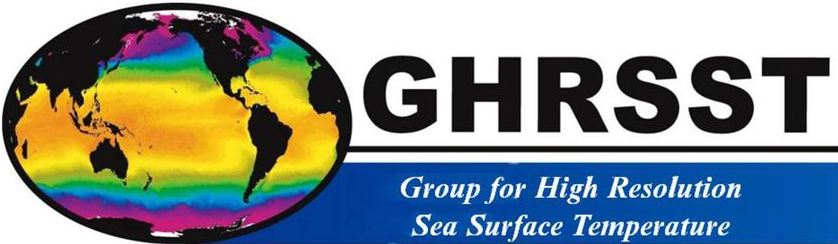
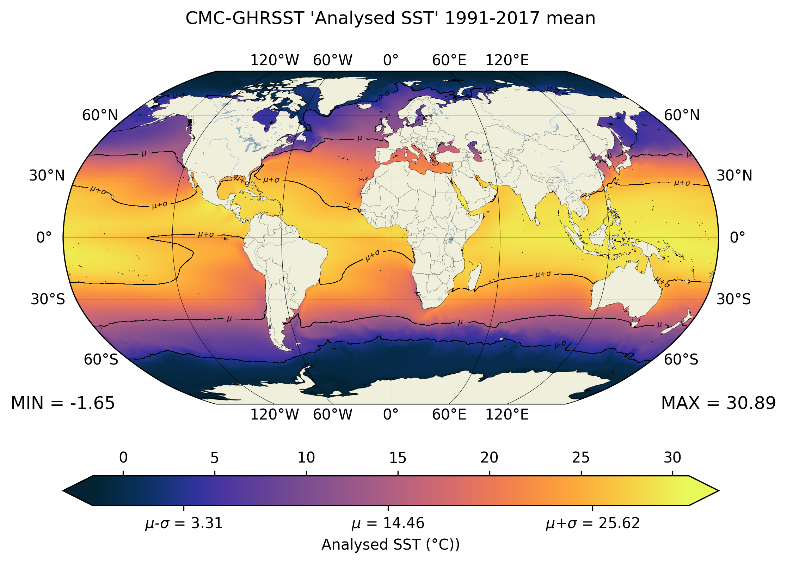
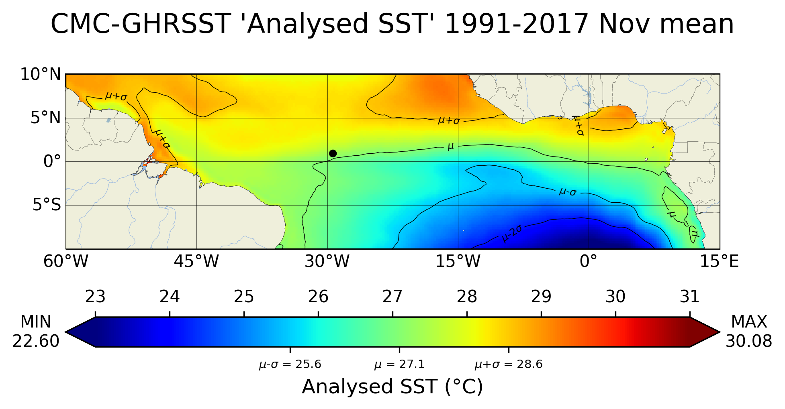
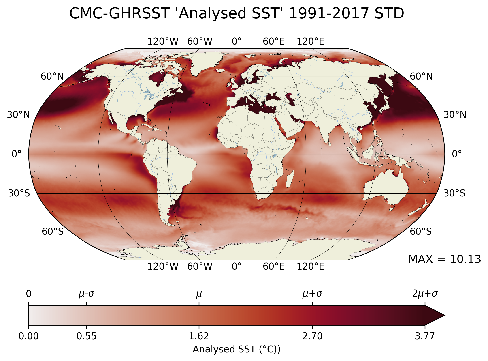

# CMC_GHRSST_Processing

- Python 3.8.13
	- Numpy 1.20.3
	- Seaborn 0.11.2
	- Matplotlib 3.5.3
	- Xarray 2022.10.0
	- Dask 2021.09
	- Cartopy 0.21.0
	- Cmocean 2.0

The Group for High-Resolution Sea Surface Temperature (SST) (GHRSST) provides a new generation of global high-resolution (<10km)
SST products to the operational oceanographic, meteorological, climate and general scientific community. 

 
In this project I've created some functions to help plot SST data on different projections (Robinson being, arguably, one of the best for global imagery). The code also
performs some previous statistics on the dataset to allow the plotting of mean +/- standard deviation contours, which are also applied in the colorbar.

There is also some snippets to plot "zoomed-in" data in a regular lat-long cartesian projection, as below:

Finally, I heard you enjoy standard deviations, so I plotted a map of standard deviations with contours of standard deviations inside it!
In all seriousness, this is useful when dealing with georeferenced data as it quickly tells you where are the regions of highest variability (e.g. for interannual scales, the El Niño
in the Equatorial Pacific; for meso-scale features, the vortices in the Agulhas retroflection etc).

It uses dask to optimize the code run (as opening these many netcdf files in nested concatenation is not a trivial task). Even less trivial is performing the chronological
mean for the monthly climatology. Big kudos to those who created this awesome tool.

It also spits out Hovmoller diagrams for each of the latitudes of interest, since they are useful for identifying meso and large-scale phenomena such as vortices and planetary (Rossby/Equatorial Kelvin) waves.

